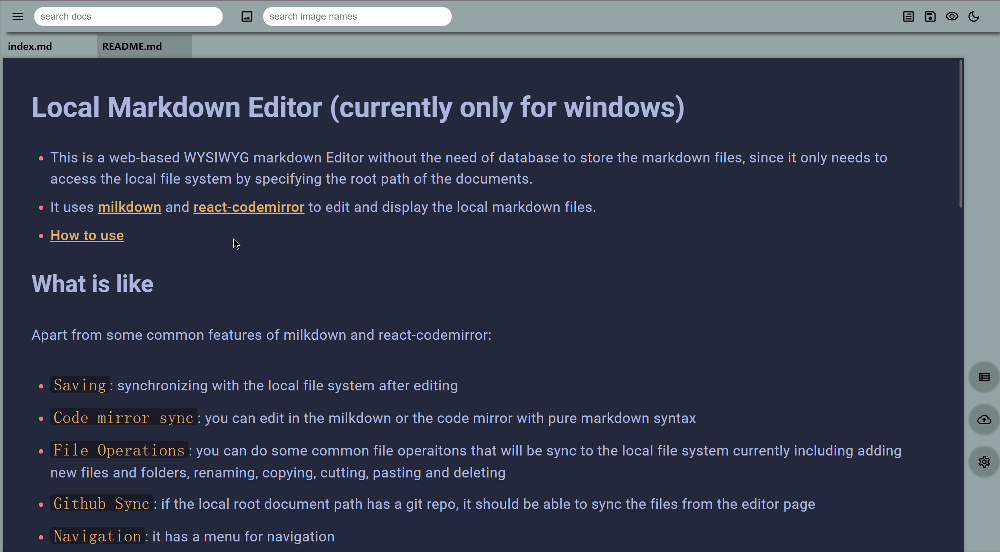

# Local Markdown Editor (currently only for windows)

*   This is a web-based WYSIWYG markdown Editor without the need of database to store the markdown files, since it only needs to access the local file system by specifying the root path of the documents.

*   It uses [milkdown](https://milkdown.dev/getting-started) and [react-codemirror](https://uiwjs.github.io/react-codemirror/) to edit and display the local markdown files.

*   [How to use](#set-up)

## Features

Apart from some common features of milkdown and react-codemirror:

*   `Saving`: synchronizing with the local file system after editing

*   `Keyboard shortcuts`: shortcut for saving and read-edit mode switch

*   `Code mirror sync`: you can edit in the milkdown or the code mirror with pure markdown syntax

*   `File Operations`: you can do some common file operaitons that will be sync to the local file system currently including adding new files and folders, renaming, copying, cutting, pasting and deleting

*   `Github Sync`: if the local root document path has a git repo, it should be able to sync the files from the editor page

*   `Navigation`: it has a menu for navigation

*   `Decent Search`: it should be able to search the docs quickly via some defined tags and the docs content

*   `Image storage`: currently using aliyun OSS as image storage, you might need to config your aliyun account




## Set up

### 1. install deps

```bash
yarn install
```

### 2. configs(optinal)

Add a config.json at the root path

```json
{
  "docRootPath": "the doc root path",
  "ignoreDirs": [".git", "imgs"],
  // (for aliyun OSS)
  "region": "oss-cn-shenzhen",
  "accessKeyId": "your accessKeyId",
  "accessKeySecret": "your accessKeySecret",
  "bucket": "your bucket name"
}

or you can just set the configs at the setting
```

### 3. compile and bundle the code

```bash
yarn build
```

### 4. open the document page

*   After the bundling, you can just click the run.bat to open the documents. The bat file is actually for window shortcut so that you can open from your desktop.

*   you can create a desktop shortcut by linking the run.bat or run.vbs file.

*   The run.vbs is to hide the command window when you click the shortchut from your desktop.

## Development

There are two main components. One is the `node server` for doc file operations; another is the `client` for documentation UI. They are developed mainly using react and typescripts. Once start, the node server and client will be auto run.

```bash
yarn start
```
